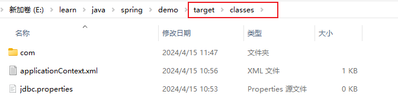
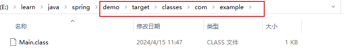

## IOC

::: note
控制反转，之前对象的控制权在类手上，会通过`new`创建 <Badge text="高耦合" type="warning"/>，现在反转到了`spring`手上
:::

#### 在xml里面注入需要的类

```xml
<bean class="com.example.dao.impl.StudentDaoImpl" id="studentDao"></bean>
```

类获取方式

```java
    public static void main(String[] args) {
        //创建Spring容器，指定要读取的配置文件路径
        ApplicationContext app = new ClassPathXmlApplicationContext("applicationContext.xml");
        //从容器中获取对象
        StudentDao studentDao = (StudentDao) app.getBean("studentDao");
    }
```

## DI依赖注入
#### 注入属性
```xml
<bean class="com.example.domain.Student" id="student">
    <!--
        name属性用来指定要设置哪个属性
        value属性用来设置要设置的值
        ref属性用来给引用类型的属性设置值，可以写上Spring容器中bean的id
    -->
    <property name="name" value="风镜"></property>
    <property name="age" value="20"></property>
    <property name="id" value="1"></property>
    <!--另一个类对象-->
    <property name="dog" ref="dog"></property>
</bean>
```

#### 创建properties文件
`jdbc.properties` 以`key:value`形式保存信息
```perporties
jdbc.url=jdbc:mysql://localhost:3306/mybatis_db?useSSL=false&characterEncoding=UTF-8
jdbc.driver=com.mysql.jdbc.Driver
jdbc.username=root
jdbc.password=root
```
#### 读取properties

在xml文件中指定要读取的文件的路径。
>我们也会用到如下写法：classpath:* *.properties  其中的* * 表示文件名任意。
```xml
<context:property-placeholder location="classpath:jdbc.properties"/>
```
::: note
classpath表示类加载路径下。
文件编译后都会保存在项目的target下


com.example下存储类的字节码文件

:::

key:value引用方式
```xml
<property name="propertyName" value="${key}"/>
```
